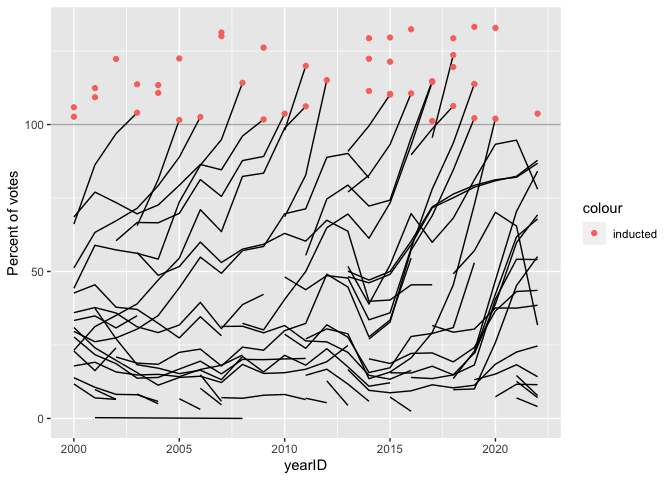

<!-- README.md is generated from README.Rmd. Please edit the README.Rmd file -->

# Lab report \#4 - instructions

Follow the instructions posted at
<https://ds202-at-isu.github.io/labs.html> for the lab assignment. The
work is meant to be finished during the lab time, but you have time
until Monday (after Thanksgiving) to polish things.

All submissions to the github repo will be automatically uploaded for
grading once the due date is passed. Submit a link to your repository on
Canvas (only one submission per team) to signal to the instructors that
you are done with your submission.

# Lab 4: Scraping (into) the Hall of Fame

<!-- -->
